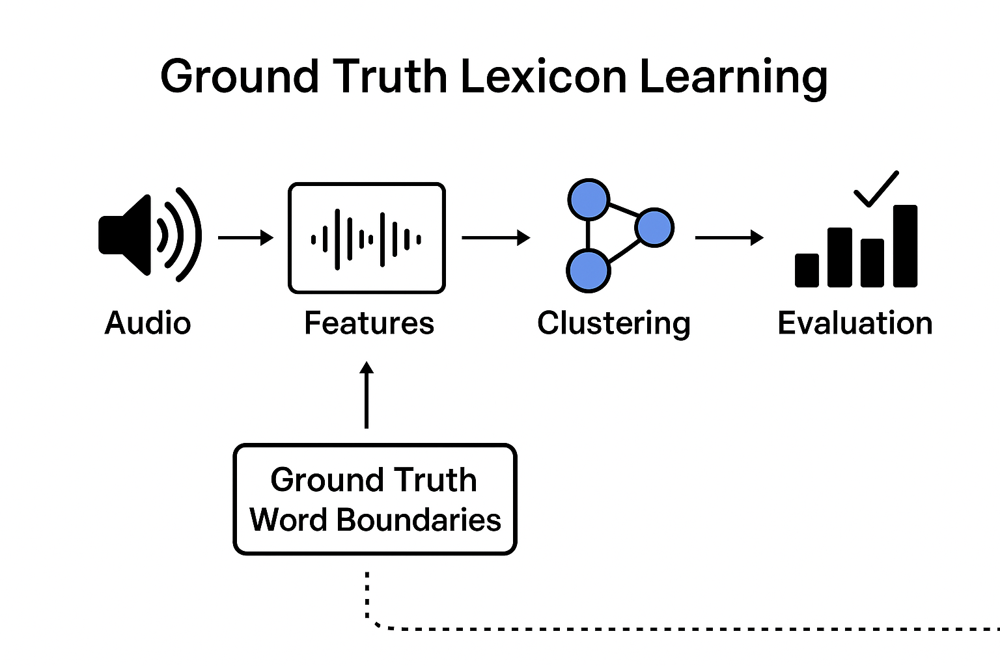

# Ground Truth Lexicon Learning

This repository provides **six lexicon learning systems** that cluster word segments based on different representations of input speech, using **ground-truth word boundaries**.



---

## Directory Structure

Data should be organized as follows:

```
Data/alignments/<language>/<dataset>/
Data/audio/<language>/<dataset>/
```

---

## Ground Truth Boundary Extraction

Extract word boundaries from the provided alignment files:

```bash
python boundaries.py <language> <dataset>
```

For **Mandarin**, extract voice activity detection (VAD) segments to split long utterances into smaller, processable segments:

```bash
python vad.py
```

---

## Graph-based Clustering

Supported `model_name` options:

```
wavlm-large, hubert-large, hubert-soft, mhubert, mandarin-hubert
```

### 1. Continuous Features + Averaging + Cosine Distance

```bash
python graph.py <language> <dataset> <model_name> <layer> cos <threshold>
```

### 2. Continuous Features + Dynamic Time Warping (DTW)

```bash
python graph.py <language> <dataset> <model_name> <layer> dtw <threshold>
```

### 3. Discrete Units + Edit Distance

```bash
python graph.py <language> <dataset> <model_name> <layer> ed <threshold> --k <k> --lmbda <lambda>
```

---

## Traditional Clustering

### 1. Continuous Features + Averaging + K-means

```bash
python avg.py <language> <dataset> <model_name> <layer> kmeans
```

### 2. Continuous Features + Averaging + BIRCH

```bash
python avg.py <language> <dataset> <model_name> <layer> birch
```

### 3. Continuous Features + Averaging + Agglomerative Hierarchical

```bash
python avg.py <language> <dataset> <model_name> <layer> agg
```

---

### Tips

* Replace placeholders `<language>`, `<dataset>`, `<model_name>`, `<layer>`, `<threshold>`, `<k>`, and `<lambda>` with appropriate values.
* Recommended to start with smaller datasets to test the pipeline before running full-scale experiments.

---

